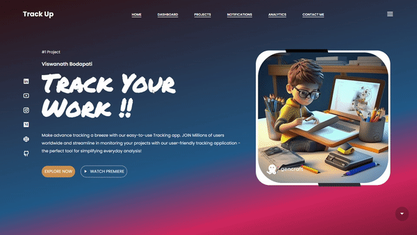

<!DOCTYPE html>
<html>

<body>
  <h1>Task and Project Management Application</h1>
  <h2>Overview</h2>
  
Welcome to our task and project management application! This application is designed to help you manage and track your tasks and projects effectively. Whether you are an individual looking for a personal task management solution or a team working collaboratively on multiple projects, this application provides the necessary tools and features to streamline your workflow.

  
  <h2>Features</h2>
  <ul>
    <li><strong>Task Management:</strong> Create, update, and delete tasks with ease. Assign tasks to specific team members and set due dates for efficient tracking.</li>
    <li><strong>Project Management:</strong> Organize your tasks into projects for better categorization and management. View project progress, deadlines, and overall status.</li>
    <li><strong>Authentication:</strong> Securely authenticate users with authentication system integration.</li>
    <li><strong>Frontend:</strong> Built using React.js, a popular JavaScript library for building user interfaces. Enjoy a responsive and interactive user experience.</li>
    <li><strong>Backend:</strong> Utilizes MongoDB, a NoSQL database, for storing and retrieving task and project data efficiently.</li>
  </ul>
  <h2>Installation</h2>
  
To install and run the application locally, follow these steps:

  <ol>
    <li>Clone the repository to your local machine.</li>
    <li>Navigate to the project directory.</li>
    <li>Install the required dependencies by running <code>npm install</code>.</li>
    <li>Configure the backend by setting up the MongoDB connection and authentication system.</li>
    <li>Start the application by running <code>npm start</code>.</li>
    <li>Access the application in your web browser at <code>http://localhost:3000</code>.</li>
  </ol>
  <h2>Contributing</h2>
  
We welcome contributions from the community to enhance the functionality and usability of this application. If you'd like to contribute, please follow the guidelines outlined in the <code>CONTRIBUTING.md</code> file.

  
  <h2>Contact</h2>
  
If you have any questions or feedback, feel free to reach out to us at <code>viswanathbodapati@gmail.com</code>.

</body>
</html>

